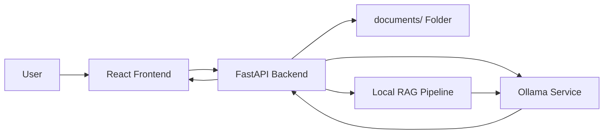

# InsightQ Architecture

This document describes the architecture of the InsightQ repository in a more detailed, standalone way.

## 1. Overview
InsightQ is a local Retrieval-Augmented Generation (RAG) application designed for researchers who want to chat with their own PDF documents without sending data to external services.

The system combines:
- a React frontend for interaction,
- a FastAPI backend for API orchestration,
- a local document folder for PDFs,
- an Ollama service for embeddings and chat generation,
- a local RAG pipeline built around document retrieval and prompt answering.

## 2. High-Level Architecture

## 3. Component Responsibilities

### Frontend
The frontend is a React single-page application that provides:
- upload controls for PDF files,
- a build/index action,
- a chat interface,
- theme switching and workspace controls.

### Backend
The backend is a FastAPI service that exposes endpoints for:
- `/upload` — saves uploaded PDFs to disk,
- `/build` — creates the retrieval pipeline,
- `/chat` — answers questions using retrieved document context,
- `/health` — health/status checks,
- `/history` — session chat history.

### Document Store
The document store is a local folder named `documents/`.
This is where uploaded PDFs are persisted for the current workspace.

### Ollama Service
Ollama provides the models used by the RAG pipeline:
- an embedding model (`nomic-embed-text`) for vector generation,
- a chat model (`llama3.2:3b`) for answer generation.

### RAG Pipeline
The RAG pipeline is responsible for:
- loading PDFs,
- splitting text into chunks,
- generating embeddings,
- retrieving relevant context,
- sending context plus the user question to the LLM.

## 4. Request Flow

### A. Upload Flow
1. The user selects one or more PDFs in the frontend.
2. The frontend sends them to the backend via `/upload`.
3. The backend writes the PDFs into `documents/`.

### B. Build Flow
1. The user clicks `Build RAG Index`.
2. The backend loads all PDFs from `documents/`.
3. The pipeline splits the content into chunks and generates embeddings.
4. The pipeline becomes ready for retrieval.

### C. Chat Flow
1. The user enters a question in the frontend.
2. The frontend sends the question to `/chat`.
3. The backend retrieves relevant chunks from the indexed documents.
4. The backend sends the chunks and question to the Ollama chat model.
5. The answer is returned to the frontend and displayed to the user.

## 5. Local vs Docker Deployment

### Local deployment
- Frontend runs on `http://localhost:3000`
- Backend runs on `http://localhost:8000`
- Ollama runs on `http://localhost:11434`

### Docker deployment
- Frontend runs on `http://localhost:8080`
- Backend runs on `http://localhost:8001`
- Ollama runs on `http://localhost:11435`

## 6. Design Notes
- The architecture is intentionally local-first for privacy.
- No external cloud service is required for the core workflow.
- The system is modular: the frontend, backend, and Ollama service can be updated independently.

## 7. Summary
InsightQ is a lightweight but practical local RAG system that makes research PDFs searchable and conversational through a modern UI and offline model execution.
