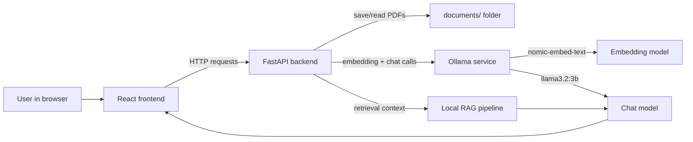

# InsightQ

InsightQ is a local document assistant built for research workflows. It lets you upload PDFs, build a local vector index, and ask natural language questions against your own documents.

## Architecture overview
InsightQ follows a simple local RAG architecture: the browser sends documents and questions to a backend service, the backend builds a retrieval pipeline from the PDFs, and the local LLM answers the question using the retrieved context.


For a dedicated standalone architecture reference, see [ARCHITECTURE.md](ARCHITECTURE.md).

### How the connections work
1. The React frontend sends uploaded PDFs to `POST /upload`.
2. The backend stores the uploaded files in `documents/`.
3. When the user clicks `Build RAG Index`, the backend loads the PDFs, splits them into chunks, generates embeddings with Ollama, and builds a local retrieval chain.
4. When the user asks a question, the frontend sends it to `POST /chat`.
5. The backend retrieves the most relevant document chunks, sends them to the Ollama chat model together with the question, and returns the answer to the frontend.

### Runtime connection map
- Local mode:
  - Frontend: `http://localhost:3000`
  - Backend: `http://localhost:8000`
  - Ollama API: `http://localhost:11434`
- Docker mode:
  - Frontend: `http://localhost:8080`
  - Backend: `http://localhost:8001`
  - Ollama API: `http://localhost:11435`

## Installation

### Clone the Repository
- git clone https://github.com/sharathbio123/InsightQ_Lite.git
- cd InsightQ_Lite

### Prerequisites
- Python 3.11+
- Node.js 18+ and npm
- Docker Engine and Docker Compose (optional for containerized deployment)

### Local Python + React setup
From the repository root:

```bash
pip install -r requirements.txt
pip install -r backend/requirements.txt
```

Start the backend:

```bash
uvicorn backend.main:app --host 0.0.0.0 --port 8000 --reload
```

In a second terminal, start the frontend:

```bash
cd frontend
npm install
npm start
```

Open `http://localhost:3000` in your browser.

The frontend uses `http://localhost:8000` by default. If your backend runs elsewhere, set:

```bash
REACT_APP_API_BASE=http://<host>:<port> npm start
```

## Docker setup (Recommended)
Use Docker Compose to run the full stack with Ollama, the backend, and the frontend.

```bash
docker compose up -d --build
```

After startup:
- Frontend: http://localhost:8080
- Backend: http://localhost:8001
- Ollama API: http://localhost:11435

Stop the stack with:

```bash
docker compose down
```

## Usage
1. Upload one or more PDF documents in the InsightQ web UI.
2. Click `Upload PDFs` and then `Build RAG Index`.
3. Ask questions in the chat box.
4. Use the theme toggle and Clear chat button to refresh the workspace.

## Notes
- The active document folder is `documents/`. Store PDFs there or upload from the frontend.
